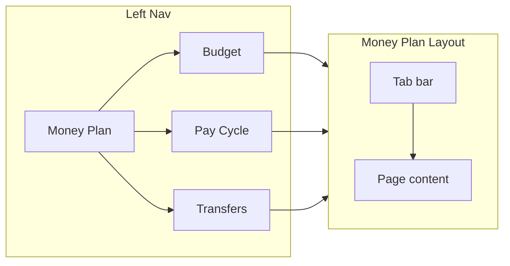
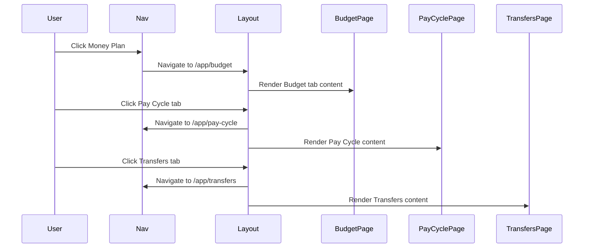

# Money Plan: tabbed Budget, Pay Cycle, and Transfers

## Overview

Introduce a "Money Plan" section in the left nav with three tabbed sub-pages (Budget, Pay Cycle, Transfers), fix pay cycle persistence, make the plan-transfers flow obvious via tabs, and remove the optional Remaining strip from the Budget header.

---

## Prototype / Wireframe

**Left nav:** Primary item **Money Plan** (links to Budget). Under it, three sub-links: **Budget**, **Pay Cycle**, **Transfers**. Clicking Money Plan or Budget goes to `/app/budget` with the Budget tab selected.

**Main content:** When on any of the three routes, the page shows a single **tab bar** at the top: `[ Budget ] [ Pay Cycle ] [ Transfers ]`. The active tab matches the current route. Below the tabs, the route’s content (Budget = income/expenses/breakdown; Pay Cycle = setup or summary; Transfers = suggested transfers + cash flow).

**Flow:** User lands on Budget → sees tabs → can move to Pay Cycle to set/edit pay cycle, then to Transfers to see suggested moves. No separate “Plan transfers” button; the Transfers tab is the CTA.

Wireframe reference (image generated to show left nav + tabbed content):

*Wireframe path: `~/.cursor/projects/Users-kierangray-Projects-wellthy/assets/money-plan-wireframe.png`*

---

## Data flow (Mermaid)

Navigation and layout relationship (no spaces in node IDs; subgraph with explicit id):

Sequence (user opens Money Plan and switches tabs):

---

## Current state (summary)

- **Nav:** Flat items including Budget and Transfers (`src/lib/constants/routes.ts`).
- **Budget:** Header has small "Plan transfers" link and "Remaining" strip; main content is income/expenses/breakdown.
- **Transfers:** When no pay cycle, shows full-page PayCycleSetup; otherwise transfers UI. No dedicated Pay Cycle route.
- **Persistence:** Repo fallback paths can return `pay_cycle: null` after save, so cache shows no pay cycle and setup reappears.

---

## Target UX

- **Left nav:** One item **Money Plan** → `/app/budget`; sub-items Budget, Pay Cycle, Transfers.
- **Tabs:** On all three routes, show **Budget | Pay Cycle | Transfers**; active tab = current route.
- **Persistence:** After saving pay cycle, returning shows configured state, not setup form.
- **Remaining:** Remove the Remaining strip from the Budget header.

---

## Implementation (concise)

1. **Routes:** Add `payCycle: '/app/pay-cycle'`. Replace Budget + Transfers nav entries with Money Plan (path `/app/budget`) and optional `children`: Budget, Pay Cycle, Transfers.
2. **Money Plan layout:** New layout component with tab bar (links to `/app/budget`, `/app/pay-cycle`, `/app/transfers`) and `<Outlet />` or `children`. Use for all three routes.
3. **Pay Cycle page:** New route rendering PayCycleSetup when no config, or summary + Edit when configured.
4. **Persistence:** In `useUserPreferences` mutation `onSuccess`, set cache to `mergePreferences(data, patch)` so saved `payCycle` is not overwritten by null when server response omits it.
5. **Budget page:** Remove "Plan transfers" header link and the Remaining strip block.
6. **Sidebar / MobileNav:** Render Money Plan with sub-links; active state when path is one of the three.
7. **Command palette:** Align labels with Money Plan (e.g. "Money Plan – Transfers").

---

## Files to touch

- `src/lib/constants/routes.ts` – add payCycle, Money Plan nav shape
- `src/routes/index.tsx` – add pay-cycle route, wrap budget/pay-cycle/transfers in MoneyPlanLayout
- New: `src/features/money-plan/MoneyPlanLayout.tsx` (or under budget) – tab bar + outlet
- New: Pay Cycle page component (reuse PayCycleSetup)
- `src/hooks/useUserPreferences.ts` – merge patch in onSuccess
- `src/features/budget/BudgetPage.tsx` – remove Plan transfers CTA and Remaining strip
- `src/components/layout/Sidebar.tsx`, `MobileNav.tsx` – Money Plan + children
- `src/components/command-palette/CommandPalette.tsx` – labels

---

## Testing

- Nav: Money Plan → Budget; sub-links and tabs switch route and content.
- Pay cycle: Save → leave and return → setup does not reappear.
- Remaining strip gone on Budget; breakdown unchanged.
- Prefetch and command palette work.

---

## Rollback

Revert nav to flat Budget + Transfers; remove Pay Cycle route and Money Plan layout; restore CTA and Remaining strip; revert cache merge. No DB changes.
