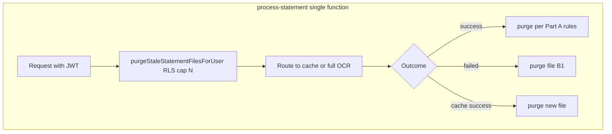

# Delete statement files after successful parse (no extra Edge Function)

## Goals

- After a **durable successful** parse, remove the PDF from Storage using the **existing anon + Clerk JWT** client (RLS).
- For **unsuccessful** parses handled inside `process-statement`, remove the file **immediately** when the import is marked `failed` (stricter than a 24-hour wait; no orphan PDF for known failure paths).
- For **abandoned** uploads (`pending` / `processing` forever, or never calling `process-statement`), use **best-effort** cleanup **inside the same** [`process-statement`](supabase/functions/process-statement/index.ts) Edge Function—**no second Edge Function**, **no service role**, **no cron**.
- Keep implementation **minimal**; rules explicit so an implementer does not guess.

---

## Timing vs Mistral

Mistral only needs the PDF while `extractStatementDataWithMistralOCR` runs (signed URL → OCR, then Chat on markdown). **Do not** delete immediately after OCR returns: if DB work fails, the user would lose the file and the import. **Delete only after durable success** for the happy path (see Part A). On **failure**, delete **after** the row is updated to `failed` (or equivalent) and Mistral is done—i.e. in `catch` / failure branches, not mid-OCR.

---

## Part A — Immediate purge after successful parse

(Unchanged from prior revision.)

### RLS (success path)

Use the same Supabase client as today: `createClient(SUPABASE_URL, SUPABASE_ANON_KEY, { global: { headers: { Authorization: Bearer <Clerk JWT> }}})` in [`supabase/functions/process-statement/index.ts`](supabase/functions/process-statement/index.ts). Call `storage.from('statements').remove([filePath])` with that client so **“Users can delete their own statement files”** applies. **Do not** use service role anywhere in this plan.

**Pre-flight:** Confirm the Storage delete policy matches the upload path layout (`userId/...` vs `auth.jwt()->>'sub'`). If delete is denied in staging, fix policies before shipping.

### Shared helpers

- **`purgeStatementObject(supabase, filePath, correlationId)`** — `remove([filePath])`; log `STATEMENT:STORAGE_PURGE` / `STATEMENT:STORAGE_PURGE_FAILED`; **never throw** (callers decide whether failure is acceptable).
- **`shouldPurgeStorageAfterFullOcrPath(row)`** — returns true only when `status === 'completed'`, `file_path` non-empty, and `error_message` does **not** indicate cache copy failure (`Failed to copy cached transactions…`, `Background copy failed`).

### `processStatement` — `try` / `catch` / `finally`

- Keep the existing outer `try { ... } catch { ... set failed ... throw }`.
- Attach **`finally`** to that **same** `try` (sibling to `catch`).
- In `finally` (respect `ENABLE_STATEMENT_FILE_PURGE`):
  1. `select('status', 'file_path', 'error_message').eq('id', statementImport.id).single()`.
  2. If `shouldPurgeStorageAfterFullOcrPath(row)`, call `purgeStatementObject`.

### Cache fast-path — branch table

`copyTransactionsSynchronously` returns a structured outcome. Purge **only** on explicit success rows in the branch table (query error / insert error / unexpected empty cache → **no** purge). On success, `purgeStatementObject` + optional `metadata.file_storage_purged_at`.

### Kill-switch

- `ENABLE_STATEMENT_FILE_PURGE` — when `false`, skip **all** Storage purges in this feature: success `finally`, cache success, **failure-path (B1)**, and **piggyback stale (B2)**. One flag keeps rollback simple (document default: `true` when unset, or `false` for first deploy—pick one in implementation PR).

### Out of scope

- No purge of `ocr_results` in this phase.
- Only the **current** import’s Storage object for cache path; not the prior duplicate’s file.
- Re-invoking `process-statement` after purge fails at signed URL; document for product/support.

---

## Part B — Unsuccessful paths without a second Edge Function

### B1 — Delete file when processing fails (primary)

Whenever `process-statement` **definitively** ends processing for this import as **unsuccessful** and Mistral/OCR is **not** going to run again for this attempt, delete the Storage object with the **same JWT client**:

| Location (conceptual) | After what |
|----------------------|------------|
| `processStatement` **`catch`** | After `statement_imports` is updated to `failed` (and before or after `throw`—ensure DB update is awaited first), call `purgeStatementObject` for the **known** `statementImport.file_path` from closure (do not rely on row read if transaction not visible yet—prefer path from `statementImport` parameter). |
| Background wrapper **`catch`** (~5546+) | Same: after status `failed` update succeeds, purge using `statementImport.file_path` from outer scope. |
| **Insert complete failure** branch (~3768+) | Before `throw`, after row updated to `failed`, purge. |

**Idempotency:** `remove` on missing object is OK; log and continue.

**Optional metadata:** `metadata.file_storage_purged_at` or `file_purge_reason: 'failed'` on successful remove (merge JSON).

This satisfies “unsuccessful upload” for **all** failures that go through these paths—typically **seconds**, not 24 hours.

**Do not** purge when:

- Handler returns **4xx** before loading the import (no `file_path` context).
- Cache fast-path leaves row **`completed`** with copy error—Part A already **retains** file; optional future: add explicit purge if product later sets status to `failed` for that case.

### B2 — Best-effort “stale” cleanup (same function, piggyback)

To approximate **“within 24 hours”** for **abandoned** rows (`pending` / `processing` with no progress, or `failed` where B1 purge errored) **without** cron or service role:

- At **the start** of the `serve` handler, **after** Clerk JWT is validated and **before** returning `202` / starting heavy work, run **`purgeStaleStatementFilesForUser(supabase, correlationId)`** (same RLS-bound client):

  1. `select id, file_path, status, created_at, updated_at` from `statement_imports` where:
     - `user_id` = current user (RLS enforces),
     - `file_path` is not null / not empty,
     - **Either** `status IN ('pending', 'processing')` **and** `created_at < now() - interval '24 hours'` (use `created_at` for “never finished”),
     - **Or** `status = 'failed'` **and** `updated_at < now() - interval '24 hours'` (retry delete if B1 failed or object was recreated—rare).
  2. **Limit** rows (e.g. **10–25** per request) to cap latency.
  3. For each row, `purgeStatementObject` (non-throwing).

**Tradeoff (explicit):** Inactive users who **never** call `process-statement` again may **never** trigger piggyback; their orphan PDFs can remain. That is the cost of avoiding a scheduled job. If product requires a **hard** SLA for **all** tenants, you would need **some** scheduled actor (not part of this plan).

### B3 — Upload path already covered

[`statementUpload.ts`](src/lib/statementUpload.ts) already removes the Storage object if **DB row creation** fails after upload. No change required unless you want symmetry with metadata flags.

---

## Verification checklist

- Success: file gone; `completed`; optional `metadata.file_storage_purged_at`.
- `processStatement` throws / background catch: row `failed`, file removed (B1).
- Insert total failure: `failed`, file removed.
- Cache copy failure: file **retained** (retry); stale piggyback may remove after 24h + next visit (B2).
- Stale `pending` 24h+, user triggers **any** new `process-statement`: piggyback removes old file (B2).
- `ENABLE_STATEMENT_FILE_PURGE=false`: success/cleanup purges skipped; document whether B1/B2 also respect same flag or a separate `ENABLE_STATEMENT_STORAGE_FAILURE_PURGE`—**recommend single flag** for all purges unless you need surgical rollback.

---

## Implementation order

1. `purgeStatementObject` + `shouldPurgeStorageAfterFullOcrPath` + unit tests.
2. Failure-path purges (B1): `processStatement` catch, background catch, insert-failure branch.
3. `processStatement` `try` / `finally` success purge + env flag + optional metadata.
4. Refactor cache copy outcome + success purge per branch table.
5. `purgeStaleStatementFilesForUser` at handler start (B2) + limit + tests for helper logic.
6. Staging validation + runbook (document piggyback limitation for inactive users).

---

## Mermaid

