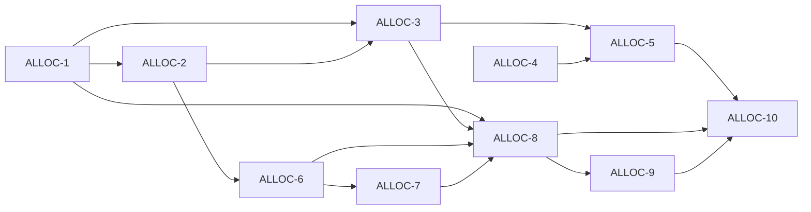

# Linear tickets: Allocate page (DS v3 + allocate-final)

Use these as **copy-paste issue bodies** in Linear. Stable IDs **`ALLOC-1` … `ALLOC-10`** map to dependency text; after creating issues in Linear, replace placeholders with real issue URLs in **Blocked by** relations.

**Spec sources:** [tasks.md](./tasks.md) (task breakdown), Cursor plan **allocate_page_redesign**, `design-system-v3.html` (Allocate CSS), `allocate-final.html` (DOM order).

---

## Epic (optional parent in Linear)

**Title:** Epic — Allocate v2 shell + plan stack (DS v3)

**Description:**

Rebuild `/app/transfers` (Allocate): sticky header, cycle strip, welded plan stack (income → committed by category → surplus), inline edit panel + destination picker per DS v3; remove modal edit and legacy transfer-row hero.

**Child issues:** ALLOC-1 through ALLOC-10 (below).

**Global defaults (apply to all child tickets):**

- Repayments: one **Repayments** committed row aggregating `repayment` + `action_required_repayment` kinds; icon bg `var(--danger-light)`.
- Grouping: **domain category id** → display name; uncategorised → single **Uncategorised** row.
- Cycle math: **local calendar** `date-fns`; document TZ rule in module header; default index = cycle containing today, else nearest future; **±24** pay periods clamp.
- CSS: scoped under **`.allocate-page`** (no global `.income-card` overrides).
- **CashFlowSummary:** disclosure **“Cash flow by account”**, below plan stack, **closed** by default.
- Copy vs data: `updatePayCycle` is **global** preferences; if Feature Copy says “this plan only”, add short footnote that settings apply across Supafolio (product sign-off on wording).

**Deferred:** per-cycle pay overrides; split surplus; bank-true past cycles; optional `allocate_v2` flag.

---

## Dependency graph (Blocked by →)

| ID | Title (short) | Blocked by (Linear relations) |
|----|----------------|-------------------------------|
| ALLOC-1 | Scope wrapper + port DS v3 CSS | — |
| ALLOC-2 | payCycles utils + tests | ALLOC-1 (recommended; TS can parallelize after ALLOC-1 lands) |
| ALLOC-3 | AllocateCycleStrip + shell header | ALLOC-1, ALLOC-2 |
| ALLOC-4 | Extract PayCycleFormFields | — |
| ALLOC-5 | AllocateEditPanel + remove Dialog | ALLOC-3, ALLOC-4 |
| ALLOC-6 | allocateCommitted + parity tests | ALLOC-2 |
| ALLOC-7 | allocateIncome + tests | ALLOC-2, ALLOC-6 |
| ALLOC-8 | AllocatePlanStack (banner + stack shell) | ALLOC-1, ALLOC-3, ALLOC-6, ALLOC-7 |
| ALLOC-9 | Surplus, shortfall, dest picker | ALLOC-6, ALLOC-7, ALLOC-8 |
| ALLOC-10 | Page composition + i18n + legacy removal | ALLOC-5, ALLOC-8, ALLOC-9 |

**Critical path (longest chain):**  
ALLOC-1 → ALLOC-2 → ALLOC-6 → ALLOC-7 → ALLOC-8 → ALLOC-9 → ALLOC-10  
(ALLOC-3 branches from 1+2; ALLOC-4 parallel; ALLOC-5 → ALLOC-10.)

---

## ALLOC-1: Scope Allocate layout wrapper and port DS v3 CSS

**Blocked by:** _none_  
**Blocks:** ALLOC-2, ALLOC-3, ALLOC-8

### Creates / modifies

- `src/features/transfers/TransfersPage.tsx` — root wrapper class only (e.g. `allocate-page`).
- New `src/features/transfers/allocate.css` **or** scoped block in `src/index.css` + import from `TransfersPage` if separate file.

### Description

Port the **Allocate screen component** CSS from **Design System v3** (`design-system-v3.html`, section from `/* ALLOCATE SCREEN COMPONENTS */` through `.edit-panel` and responsive rules). Nest or prefix **all** rules under `.allocate-page` so dashboard `.income-card` / shadcn are unchanged.

Banner + `.plan-stack` opacity **0.72** for **upcoming and past** per DS v3 (do not follow allocate-final.html demo script which only dims for upcoming).

### Acceptance criteria

- [ ] Configured Allocate view root has scope class wrapping new UI.
- [ ] All ported rules live under scope (no unscoped `.btn-ghost` overrides).
- [ ] Smoke: existing `.income-card` / `.income-amount` usages elsewhere unchanged visually.
- [ ] `npm test` / `vitest` unchanged suites still pass.

### Notes

Source of truth: DS v3 file (repo or Downloads path used by team).

### Human input

none

---

## ALLOC-2: Add pay cycle list and cycle-state utilities

**Blocked by:** ALLOC-1 (soft: pure TS can ship in parallel; recommend after ALLOC-1 for path consistency)  
**Blocks:** ALLOC-3, ALLOC-6, ALLOC-7

### Creates / modifies

- `src/features/transfers/utils/payCycles.ts`
- `src/features/transfers/utils/__tests__/payCycles.test.ts`

### Description

Build ordered pay dates from `PayCycleConfig` (`frequency`, `nextPayDate`). For each index derive `active` | `upcoming` | `past` vs **today** (local calendar). Default index = cycle containing today; if none, nearest future pay. Clamp to **±24** pay periods (single constant).

Document **timezone / start-of-day** rule in file header (`date-fns`, local).

### Acceptance criteria

- [ ] Exported functions build cycle list + state per index.
- [ ] Default index + clamp behaviour covered by tests.
- [ ] Tests: weekly / fortnightly / monthly, pay-day boundary, first/last index inputs for disabled chevrons.

### Notes

Do not wire UI in this ticket.

### Human input

none

---

## ALLOC-3: Build AllocateCycleStrip and wire shell header

**Blocked by:** ALLOC-1, ALLOC-2  
**Blocks:** ALLOC-5, ALLOC-8

### Creates / modifies

- `src/features/transfers/components/AllocateCycleStrip.tsx` (new)
- `src/features/transfers/TransfersPage.tsx`

### Description

**Layer 1–2:** Sticky header (DS): title **Allocate**, `btn-ghost btn-sm` **Edit plan** (stub handler OK until ALLOC-5). **Layer 2:** Cycle strip — chevrons, three slots, right badge; disable chevrons at ends; `@media (max-width: 768px)` hide prev/next slots + badge per DS.

Subtitle reflects **active / upcoming / past** via i18n (past key placeholder OK until ALLOC-10).

### Acceptance criteria

- [ ] Sticky header + cycle strip match DS layout tokens.
- [ ] Mobile responsive rules applied.
- [ ] Strip uses `payCycles` utilities + props only (no duplicated date math).

### Notes

`.plan-col` max-width can stub until ALLOC-10.

### Human input

none

---

## ALLOC-4: Extract shared pay-cycle form core

**Blocked by:** _none_ (coordinate merge order: suggest after ALLOC-3)  
**Blocks:** ALLOC-5

### Creates / modifies

- `src/features/transfers/components/PayCycleFormFields.tsx` (or equivalent) + optional `usePayCycleForm.ts`
- `src/features/transfers/components/PayCycleSetup.tsx` — refactor to consume shared fields; behaviour unchanged

### Description

Extract shared **react-hook-form + zod** fields for pay cycle. **Frequency** UI must match schema only: `weekly` | `fortnightly` | `monthly` (no extra HTML options until schema expands). Surplus destination in edit flow = optional `savingsAccountId` (UUID).

### Acceptance criteria

- [ ] Empty-state `PayCycleSetup` still persists same `PayCycleConfig` via `updatePayCycle`.
- [ ] Test: shared schema rejects invalid UUID / date.
- [ ] Frequency options match zod enum only.

### Human input

none

---

## ALLOC-5: Implement AllocateEditPanel and remove edit Dialog

**Blocked by:** ALLOC-3, ALLOC-4  
**Blocks:** ALLOC-10

### Creates / modifies

- `src/features/transfers/components/AllocateEditPanel.tsx` (new)
- `src/features/transfers/TransfersPage.tsx` — remove `Dialog` edit path; toggle inline panel

### Description

Edit / **Cancel** toggles `.edit-panel.open`; subtitle **Adjusting your plan** when open. **Cancel** resets form to last saved `payCycle`. **Update plan** calls `updatePayCycle`, closes panel, invalidates transfer/cashflow queries as today. No modal for primary edit.

If copy implies “this plan only” but persistence is global, use epic footnote default; product sign-off if they reject.

### Acceptance criteria

- [ ] Panel open/close + subtitle behaviour per spec.
- [ ] Cancel discards unsaved state.
- [ ] Update persists and invalidates queries.
- [ ] No edit `Dialog` on happy path.

### Human input

Product sign-off on global-persistence footnote if copy must stay literal v1.1 without qualification.

---

## ALLOC-6: Implement cycle-scoped committed aggregation + parity test

**Blocked by:** ALLOC-2  
**Blocks:** ALLOC-7, ALLOC-8, ALLOC-9

### Creates / modifies

- `src/features/transfers/utils/allocateCommitted.ts` (name flexible)
- `src/features/transfers/utils/__tests__/allocateCommitted.test.ts`

### Description

Input: cycle window (from `payCycles`), expenses, categories. Output rows: `{ categoryId, displayName, metaLine, amount, isMutedZero }`. **Repayments** row: one approach only (aggregate repayment kinds **or** expense flags) — **document in file header**.

**Parity (active cycle):** `sum(row.amount)` equals sum of **coverage** suggestions from `calculateTransferSuggestions` for frozen fixture ± documented rounding.

### Acceptance criteria

- [ ] Row shape + grouping per epic defaults.
- [ ] Parity test passes or documented gap + human escalation (no silent mismatch).

### Human input

none if parity holds; else PM/engineering accepts divergence.

---

## ALLOC-7: Implement primary income + secondary links for plan stack

**Blocked by:** ALLOC-2, ALLOC-6  
**Blocks:** ALLOC-8, ALLOC-9

### Creates / modifies

- `src/features/transfers/utils/allocateIncome.ts` + tests

### Description

Primary income **amount for selected cycle**; formula documented; align with Budget assumptions or document delta. Source line: `[Name] · [Account] · [Frequency]` from `useIncomes` / `useAccounts` / `payCycle`.

Secondary: `.income-card-secondary` links to `ROUTES.app.budget` with query param **only if** Budget reads it; else base Budget URL (remove TODO when focus works).

### Acceptance criteria

- [ ] Primary amount + source line implemented.
- [ ] Secondary link(s) + unit test for one secondary string.

### Human input

none

---

## ALLOC-8: Assemble AllocatePlanStack (income, committed, banner, opacity)

**Blocked by:** ALLOC-1, ALLOC-3, ALLOC-6, ALLOC-7  
**Blocks:** ALLOC-9, ALLOC-10

### Creates / modifies

- `src/features/transfers/components/AllocatePlanStack.tsx` (new; may split under `components/allocate/`)

### Description

Order: optional **upcoming banner** (`.upcoming-banner.show` for **upcoming and past**) → `.plan-stack` (income → committed → surplus **shell**). Income: DS classes `.income-card-label`, `.income-card-amount-lg`, `.income-card-source` + dot. Committed: `.plan-section`, `.commitment-row`, icon bg map per spec. Opacity: `plan-stack` **0.72** when banner visible, **1** when active. Committed tooltip: Radix + `.tooltip-icon` visuals.

Surplus header number may be placeholder until ALLOC-9.

### Acceptance criteria

- [ ] DOM order + classes match DS v3 + allocate-final.
- [ ] Banner + opacity rules correct.
- [ ] Accessible tooltips for committed label.

### Human input

none

---

## ALLOC-9: Surplus, shortfall, destination picker + preferences

**Blocked by:** ALLOC-6, ALLOC-7, ALLOC-8  
**Blocks:** ALLOC-10

### Creates / modifies

- `AllocatePlanStack.tsx` and/or `SurplusSection.tsx`
- `useUserPreferences.ts` **only** if new fields required (prefer **none** — reuse `savingsAccountId`)

### Description

Surplus = income − committed for selected cycle; header **19px** surplus total per DS; **Shortfall** label + red when negative. `.shortfall-alert` + link **Review your amounts in Recurring →** to Budget; hide destination sub-states. Destination flows: set / unset / picker open; Confirm → `updatePayCycle`; Cancel restores draft. Surplus tooltip (non-shortfall): **Income $X minus committed $Y** via i18n. **+ Add an account** when no accounts; no crash on zero accounts. No split destinations v1.

### Acceptance criteria

- [ ] All surplus / shortfall / picker behaviours above.
- [ ] Tooltip arithmetic string present.

### Human input

none

---

## ALLOC-10: Finalise TransfersPage composition, i18n, and remove legacy hero

**Blocked by:** ALLOC-5, ALLOC-8, ALLOC-9  
**Blocks:** _none_

### Creates / modifies

- `src/features/transfers/TransfersPage.tsx`
- Stop using / remove `TransferSuggestions.tsx` from page (delete file only if grep shows unused)
- `CashFlowSummary.tsx` — parent disclosure only
- `src/locales/en-US/pages.json`, `src/locales/en-AU/pages.json`
- `src/features/transfers/__tests__/` or update existing RTL tests

### Description

Full page: header + cycle strip + `.plan-col` padding + edit panel + banner + plan stack + disclosure `CashFlowSummary` + `UnallocatedWarning` if still relevant. Remove view-mode **Select**, “Move these amounts…” hero, old repayment footer. Feature Copy v1.1 (surplus tooltip, shortfall, banner, `allocateSubtitlePast`, etc.). **When edit open and user changes cycle:** close edit panel + reset form to saved `payCycle` (comment in code).

### Acceptance criteria

- [ ] Composition matches spec layers.
- [ ] No legacy hero / select / footer strings.
- [ ] i18n v1.1 keys complete.
- [ ] `vitest` green for updated transfers tests.

### Human input

none

---

## Linear housekeeping checklist

After creating issues:

1. Set parent **Epic** on ALLOC-1…ALLOC-10 if using Linear sub-issues.
2. Add **Blocked by** relations exactly as table above (use ALLOC-2 soft-dep on ALLOC-1 per team preference).
3. Labels suggestion: `Allocate`, `frontend`, `design-system`.
4. Link each issue description footer: `specs/allocate/tasks.md` + plan file path in repo.
